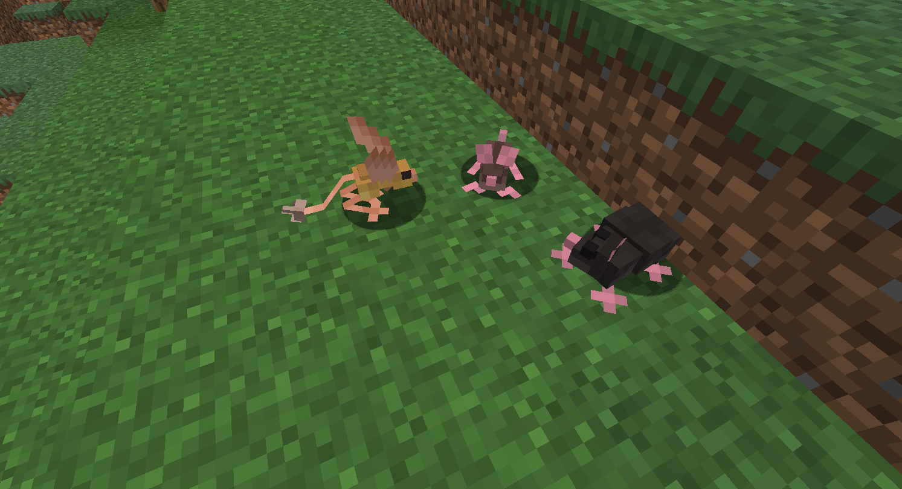
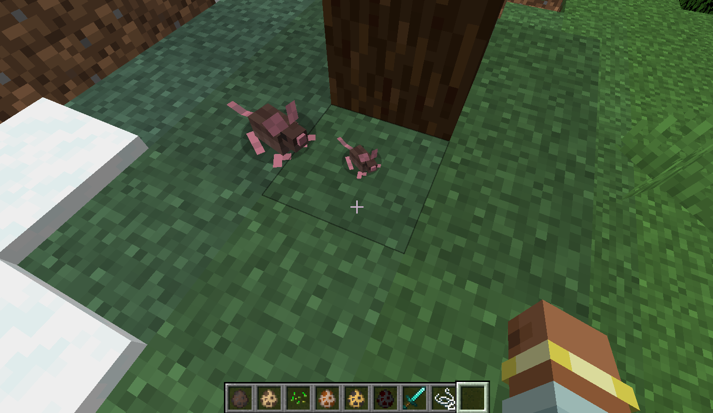

## Mod adds:

- Regular-ass mouse
- Black rat
- Jerboa
- Woolly Mouse - mad scientist experiment in the real world/native population of snowy biomes in Minecraft

---

## Features:

Rats can be tamed but will not help owner in fights due to being rats.

Woolly mice can be sheared for their precious-precious wool

Jerboas spawn in desert and badland biomes. They can hear your thoughts.

Baby mice look adorable

---

## Credits:

Modeling and texturing: hidingfox

Programming assistance: SalTay, SilentTem

Mouse behavior references/muse: breb

